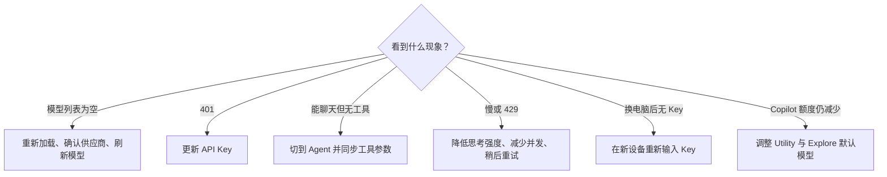

# 处理 UCP 和 DeepSeek 常见问题

> 目标：按现象直接找到处理顺序；每一项先给操作，再解释原因。

## 模型选择器里没有 DeepSeek

1. 执行 **Developer: Reload Window**。
2. 打开 **Unify Chat Provider: 管理供应商**，确认 DeepSeek 配置已保存。
3. 启用 **自动拉取官方模型**，刷新模型列表。
4. 更新 UCP，运行 **同步内置参数到所有配置**。

> [此处应有：图 01——UCP 供应商管理页面；框出“自动拉取官方模型”、刷新按钮和模型列表为空的位置]

通常是扩展还没重新加载、供应商未保存，或模型列表没有刷新。

## 返回 401

1. 在 DeepSeek 控制台创建新 Key。
2. 更新 UCP 中的身份验证。
3. 删除旧 Key，并清理剪贴板。

> [此处应有：图 02——VS Code Chat 返回 401 Unauthorized 的错误提示；框出状态码和请求供应商；隐藏请求 ID、Key 和账号]

401 表示 Key 无效、已删除，或复制时带入了多余字符。排错不需要把 Key 贴进聊天。

## 能聊天，但不能调用工具

1. 确认会话模式是 **Agent**。
2. 选择 V4 Flash 或 V4 Pro。
3. 在 UCP 中同步最新内置参数，确认工具调用能力已启用。

> [此处应有：图 03——同一会话中“Ask 模式只能聊天”与“Agent 模式出现工具动作”的对比图；框出模式选择器和工具调用记录]

普通聊天成功只说明模型能回复，不代表当前配置已经支持 Agent 工具调用。

## 请求很慢或出现 429

1. 把思考强度从 `Max` 调到 `High`。
2. 减少并行会话，稍后重试。
3. 检查代理超时，避免在模型思考期间提前断开连接。

> [此处应有：图 04——429 或请求超时的错误提示，以及将思考强度从 Max 改为 High 的模型菜单；框出状态码和强度选项]

复杂思考和长上下文会增加首 Token 延迟；429 表示当前并发受限。DeepSeek 可能在等待推理时发送 keep-alive。

## 换电脑后配置还在，但 Key 不见了

在新设备上重新输入 Key。UCP 配置可以随 VS Code 设置同步，但 Secret Storage 中的 Key 默认不会同步——不是它闹脾气，是它没有把钥匙塞进行李箱。

## Copilot 免费额度仍在减少

运行 **Unify Chat Provider: 更改 VS Code 默认模型**，把 Utility、Explore、Ask 等后台任务切换到 DeepSeek。聊天会话使用 DeepSeek，不代表所有后台任务都已经跟着切换。

## 相关笔记

- [Windows：从安装到 Agent 验证](Windows-VS-Code-UCP-DeepSeek-Agent-工作流)
- [用 UCP 设置 VS Code 默认模型](UCP-设置-VS-Code-默认模型)

最后核验：**2026-07-19**。参考：[DeepSeek 速率限制](https://api-docs.deepseek.com/quick_start/rate_limit) 与 [UCP 项目说明](https://github.com/smallmain/vscode-unify-chat-provider)。