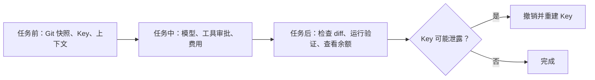

# 检查 VS Code Agent 的安全与成本

> 目标：在开始任务前用一分钟确认代码快照、Key、上下文、工具权限和模型成本。

## 直接照做

- [ ] 运行 `git status`，需要保留的修改已经提交或暂存清楚。
- [ ] DeepSeek Key 只在 UCP 的 Secret Storage 中，仓库和截图里没有实际 Key。
- [ ] 当前选中的代码与聊天上下文可以发送给所选模型供应商。
- [ ] Utility、Explore 等后台任务使用的是预期模型。
- [ ] 终端和 MCP 的写入动作仍在可见的审批范围内。
- [ ] 使用 V4 Pro、长上下文或 `Max` 思考强度前，已看过余额和任务规模。

> [此处应有：图 01——UCP 管理供应商页面中的 DeepSeek 配置；框出 `$UCPSECRET:...$` 引用和 Secret Storage 提示；实际 Key、账号和余额隐藏]

任务结束后：

1. 查看 Git diff，保留需要的修改。
2. 运行项目验证命令。
3. 检查 DeepSeek 余额；如果 Key 可能泄露，立即在控制台撤销并重建。

## 模型怎么选

| 情况 | 先选 |
| --- | --- |
| 日常问答、搜索、轻量修改 | V4 Flash + `High` |
| 复杂规划、跨文件实现、困难排错 | V4 Pro；需要时再用 `Max` |
| 图片理解 | 另选支持视觉的模型 |

> [此处应有：图 02——DeepSeek 模型选择器与开放平台余额页的组合图；框出 V4 Flash、V4 Pro、思考强度和充值入口；隐藏实际余额与账号]

## 这些检查分别在管什么

- Git 快照让修改可比较、可局部撤销。
- Secret Storage 避免 Key 随设置、日志或提交扩散。
- 上下文检查用于确认哪些内容会发送到外部 API。
- 工具审批限制 Agent 能直接影响的文件、终端和外部系统。
- 模型与思考强度会影响延迟和 Token 成本。

清单的作用是省下事后的侦探时间，不是给开发过程加一位板着脸的监考老师。

## 相关笔记

- [用 UCP 设置 VS Code 默认模型](UCP-设置-VS-Code-默认模型)
- [给 VS Code Agent 接入 MCP](VS-Code-Agent-接入-MCP)

最后核验：**2026-07-19**。价格以 [DeepSeek API 定价页](https://api-docs.deepseek.com/quick_start/pricing) 为准。