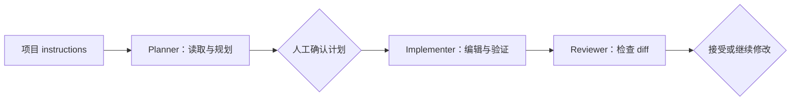

---
tags:
   - VS Code
   - Agent
   - 项目规则
---

<!-- article-id: FN-003 -->

# 给 VS Code Agent 添加项目规则

> 目标：让 Agent 每次进入项目时都知道技术栈、常用命令、文件边界和完成标准。

## 直接照做

1. 在 Chat 中输入 `/init`。
2. 检查生成的 `.github/copilot-instructions.md`，保留项目事实，删掉空泛口号。

<!-- image-id: FN-003-01 | path: images/fn-003/fn-003-01.png -->
> [此处应有：图 FN-003-01——VS Code 资源管理器与编辑器并排显示 `.github/copilot-instructions.md`；框出文件路径、构建命令和验证要求；隐藏私人项目名]

3. 至少写清楚这些内容：
   - 项目技术栈和目录职责。
   - 构建、测试、格式化命令。
   - 不应修改的文件和安全边界。
   - 代码风格、错误处理和提交约定。
   - 任务完成前要执行的验证。
4. 需要拆分角色时，在 `.github/agents/*.agent.md` 中创建 custom agents：
   - Planner：只允许搜索和读取。
   - Implementer：允许编辑、终端和测试。
   - Reviewer：读取 diff，检查正确性、安全和回归风险。
5. 需要人工检查点时，用 handoff 串起“规划 → 实现 → 审查”。

<!-- image-id: FN-003-02 | path: images/fn-003/fn-003-02.png -->
> [此处应有：图 FN-003-02——Copilot Chat 的 custom agent 选择器；展示 Planner、Implementer、Reviewer 和 handoff；框出各角色的工具差异]

## 怎么确认成功

- 新会话能说出项目的构建和测试命令。
- Agent 遇到受保护文件时会先说明边界，而不是直接修改。
- Planner 无法写文件，Implementer 可以运行验证，Reviewer 聚焦 diff。

## 写什么最有用

优先写仓库里能验证的事实，例如准确命令、目录职责和测试要求。像“写出高质量代码”这种句子很友好，但信息量和办公室绿植差不多。

## 什么时候拆 custom agent

一个角色需要明显不同的工具权限或审查视角时再拆。只是语气略有区别，不必急着多养一个角色。

## 相关笔记

- [Windows：从安装到 Agent 验证](Windows-VS-Code-UCP-DeepSeek-Agent-工作流)
- [给 VS Code Agent 接入 MCP](VS-Code-Agent-接入-MCP)

最后核验：**2026-07-19**。