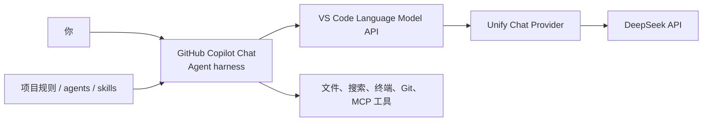

<!-- article-id: FN-001 -->

# Windows 上用 VS Code + UCP + DeepSeek 跑通 Copilot Chat Agent

> 目标：从一台装好 Windows 的电脑出发，在 VS Code 里接入 DeepSeek，并跑通一次会读文件、改代码、执行命令和处理错误的 Agent 工作流。

这套工作流的核心并不依赖 Windows；Copilot Chat、UCP、DeepSeek 和项目规则都可以跨平台使用。本篇先把 Windows 路线完整走通，macOS 版本后续单独补上。


<!-- image-id: FN-001-01 | path: images/fn-001/fn-001-01.png -->
> [此处应有：图 FN-001-01——最终效果总览；同一张图里展示 Copilot Chat 的 Agent 模式、DeepSeek V4 Flash 模型、终端运行结果和源代码管理 diff；隐藏账号、私人路径和通知]

## 准备清单

- Windows 10 或 Windows 11。
- 一个 GitHub 账号；Copilot Free 可以完成这套接入。
- 一个 DeepSeek 开放平台账号和少量 API 余额。
- 能访问 GitHub、VS Code Marketplace 与 DeepSeek API 的网络环境。
- 一个不包含敏感代码的练习目录。

## 直接照做

### 1. 安装 Git for Windows

1. 打开 [Git for Windows 官方页面](https://git-scm.com/install/windows)，下载 x64 安装包。
2. 没有特殊需求时保留默认选项并完成安装。
3. 关闭旧 PowerShell，重新打开一个窗口。
4. 运行：

```powershell
git --version
```

5. 设置提交身份：

```powershell
git config --global user.name "你的 GitHub 用户名"
git config --global user.email "你的 GitHub noreply 邮箱"
```

<!-- image-id: FN-001-02 | path: images/fn-001/fn-001-02.png -->
> [此处应有：图 FN-001-02——PowerShell 中依次显示 `git --version` 和 Git 提交身份查询结果；框出版本号与 noreply 邮箱；隐藏 Windows 用户目录]

### 2. 安装 VS Code 并打开 Copilot Chat

1. 打开 [VS Code 的 Windows 安装说明](https://code.visualstudio.com/docs/setup/windows)，下载 **User Setup**。
2. 完成安装后重新打开 PowerShell。
3. 运行：

```powershell
code --version
```

4. 打开 VS Code，点击状态栏中的 Copilot 图标。
5. 选择 **Use AI Features**，使用 GitHub 账号登录。
6. 没有付费订阅时，按页面提示使用 Copilot Free。
7. 按 `Ctrl+Shift+I` 打开 Chat。

<!-- image-id: FN-001-03 | path: images/fn-001/fn-001-03.png -->
> [此处应有：图 FN-001-03——VS Code 首次打开 Copilot Chat 的界面；框出 Copilot 图标、Chat 入口、模式选择器和模型选择器；隐藏 GitHub 头像与账号名]

到这里，`git --version` 和 `code --version` 都应能输出版本号，VS Code 也能打开 Chat。版本号出现就可以继续，暂时不用研究安装器里的每一颗螺丝。

### 3. 安装 Unify Chat Provider

1. 按 `Ctrl+Shift+X` 打开扩展市场。
2. 搜索 `@id:SmallMain.vscode-unify-chat-provider`。
3. 确认扩展名称是 **Unify Chat Provider**、发布者是 **SmallMain**，然后安装。
4. 执行 **Developer: Reload Window**。
5. 按 `Ctrl+Shift+P`，输入 `ucp:`；能看到一组 UCP 命令就继续。

<!-- image-id: FN-001-04 | path: images/fn-001/fn-001-04.png -->
> [此处应有：图 FN-001-04——VS Code 扩展市场中的 Unify Chat Provider 页面；框出扩展名、发布者 SmallMain 和安装状态]

### 4. 创建 DeepSeek API Key

1. 登录 [DeepSeek 开放平台](https://platform.deepseek.com/)。
2. 查看余额并按需充值。
3. 打开 [API Keys](https://platform.deepseek.com/api_keys)。
4. 创建一个给 VS Code 使用的 Key，并临时复制它。

<!-- image-id: FN-001-05 | path: images/fn-001/fn-001-05.png -->
> [此处应有：图 FN-001-05——DeepSeek API Keys 页面；框出创建按钮和 Key 名称；实际 Key、余额、账号与其他项目全部隐藏]

Key 会直接影响账户余额。后面的配置完成后清理剪贴板即可，不需要让它在桌面上拥有一个温馨的小家。

### 5. 用 UCP 添加 DeepSeek

1. 打开命令面板，运行 **Unify Chat Provider: 从内置供应商列表添加供应商**。
2. 搜索并选择 **DeepSeek**。
3. 选择 API Key 身份验证，粘贴刚创建的 Key。
4. 在导入页面确认配置并保存。

内置配置应包含：

| 字段 | 值 |
| --- | --- |
| API 格式 | OpenAI Chat Completion |
| Base URL | `https://api.deepseek.com` |
| 身份验证 | API Key |
| 模型 | 自动拉取官方模型，并使用 UCP 内置参数 |

<!-- image-id: FN-001-06 | path: images/fn-001/fn-001-06.png -->
> [此处应有：图 FN-001-06——UCP 的 DeepSeek 供应商导入页；框出供应商名称、OpenAI Chat Completion、Base URL 和 API Key 认证；实际 Key 隐藏]

保存后打开 **Unify Chat Provider: 管理供应商**：

- 能看到 DeepSeek 供应商。
- 模型列表中有 `deepseek-v4-flash` 和 `deepseek-v4-pro`。
- 设置文件里只有 `$UCPSECRET:...$` 引用，没有实际 Key。

如果没有模型，打开 DeepSeek 的模型列表，启用 **自动拉取官方模型**，再刷新官方模型。

<!-- image-id: FN-001-07 | path: images/fn-001/fn-001-07.png -->
> [此处应有：图 FN-001-07——UCP 管理供应商与 Copilot Chat 模型选择器的并排截图；左侧框出自动拉取和刷新按钮，右侧框出 DeepSeek V4 Flash 与 V4 Pro]

模型先这样选：

| 模型 | 先用在这里 |
| --- | --- |
| `deepseek-v4-flash` | 日常问答、搜索、轻量修改和高频 Agent 任务 |
| `deepseek-v4-pro` | 复杂规划、跨文件实现和困难排错 |

旧名称 `deepseek-chat` 与 `deepseek-reasoner` 将于 **2026-07-24 15:59 UTC** 弃用，新配置直接使用 V4 Flash 或 V4 Pro。

### 6. 在 Copilot Chat 选择 DeepSeek

1. 按 `Ctrl+Shift+I` 打开 Chat。
2. 把会话模式切换到 **Agent**。
3. 选择 **DeepSeek V4 Flash (DeepSeek)**。
4. 如果模型菜单提供思考强度，先选择 `High`；困难任务再使用 `Max`。

<!-- image-id: FN-001-08 | path: images/fn-001/fn-001-08.png -->
> [此处应有：图 FN-001-08——Copilot Chat 顶部的模式与模型选择区域；框出 Agent、DeepSeek V4 Flash 和 High；隐藏账号信息]

### 7. 跑一次真正的 Agent 验证

新建一个空目录，在 VS Code 终端中运行：

```powershell
git init
code .
```

在 Agent 会话中发送：

> 请先检查当前工作区并给出简短计划。然后创建一个 `hello-agent.ps1`：接受 `-Name` 参数，输出带当前时间的问候语。运行 `./hello-agent.ps1 -Name Foggy` 验证；如果失败就修复。最后总结修改内容和验证结果。

逐次查看文件修改和终端动作，任务结束后打开源代码管理视图看 diff。

<!-- image-id: FN-001-09 | path: images/fn-001/fn-001-09.png -->
> [此处应有：图 FN-001-09——Agent 会话中的完整动作链；用编号标出读取工作区、创建文件、运行脚本、根据错误修复四个阶段；隐藏本机路径]

<!-- image-id: FN-001-10 | path: images/fn-001/fn-001-10.png -->
> [此处应有：图 FN-001-10——验证结果；左侧终端显示带时间的问候语，右侧源代码管理显示 `hello-agent.ps1` diff；框出最终输出和新增文件]

## 怎么确认成功

- Agent 先读取工作区，再给出简短计划。
- 工作区出现 `hello-agent.ps1`。
- 终端实际运行脚本，并输出带时间的问候语。
- 如果第一次运行失败，Agent 会读取错误并继续修复。
- 源代码管理视图能看到完整改动。

只回一句“你好”还不算通关，毕竟聊天和干活是两回事。

## 出问题先看这里

### 模型选择器里没有 DeepSeek

重新加载窗口，在 UCP 中确认供应商已保存，再启用自动拉取并刷新模型列表。

### 返回 401

在 DeepSeek 控制台创建新 Key，更新 UCP 身份验证，再删除旧 Key。401 通常表示 Key 无效、已删除或复制时带入了多余字符。

### 能聊天，但不能调用工具

确认当前是 **Agent** 模式，使用 V4 Flash 或 V4 Pro，并在 UCP 中同步最新内置参数。

### 请求很慢或出现 429

把思考强度从 `Max` 调到 `High`，减少并行会话并稍后重试。更多现象集中在[常见问题页](UCP-DeepSeek-常见问题)。

## 跑通后按需查

- [设置 VS Code 默认模型](UCP-设置-VS-Code-默认模型)：让 Utility、Explore、Plan 等后台任务也使用预期模型。
- [给 Agent 添加项目规则](VS-Code-Agent-项目规则)：固定项目命令、目录职责、边界和完成标准。
- [给 Agent 接入 MCP](VS-Code-Agent-接入-MCP)：连接浏览器、数据库、工单等外部能力。
- [检查安全与成本](VS-Code-Agent-安全与成本)：开始任务前快速检查 Key、上下文、权限和模型费用。
- [处理 UCP 和 DeepSeek 常见问题](UCP-DeepSeek-常见问题)：按 401、无模型、无工具和 429 等现象查阅。

这些页面都属于按需内容，不影响从安装走到第一次 Agent 验证。

## 这套组合做了什么



| 层 | 负责什么 |
| --- | --- |
| DeepSeek | 理解任务、推理并决定下一步动作 |
| UCP | 保存供应商配置，把模型请求发送到 DeepSeek API |
| Copilot Chat | 组织 Agent 循环并调用工具 |
| VS Code | 展示修改、运行命令、连接 Git 和调试器 |
| 项目配置 | 保存 instructions、custom agents、skills 和 hooks |

UCP 在这里是模型提供者，不是另一套 Agent 框架。换模型不会拿走 Copilot Chat 原有的 Agent 模式和工具体系。

## Windows 与其他平台的边界

这篇里真正属于 Windows 的部分主要是安装包、PowerShell 命令和路径格式。下面这些层在 macOS 上仍然成立：

- Copilot Chat 负责 Agent 循环和工具界面。
- UCP 负责接入 DeepSeek 等模型供应商。
- DeepSeek 负责推理和工具调用决策。
- instructions、custom agents、skills、hooks 与 MCP 继续放在 VS Code 和项目里。

后续 macOS 分册会保留一条从安装到验证的完整路径，而不是让读者在 Windows 页面里自己做系统翻译。

## 官方资料

- [VS Code：在 Windows 上安装](https://code.visualstudio.com/docs/setup/windows)
- [VS Code：设置 GitHub Copilot](https://code.visualstudio.com/docs/setup/copilot)
- [Git for Windows](https://git-scm.com/install/windows)
- [Unify Chat Provider 扩展市场](https://marketplace.visualstudio.com/items?itemName=SmallMain.vscode-unify-chat-provider)
- [Unify Chat Provider 项目说明](https://github.com/smallmain/vscode-unify-chat-provider)
- [DeepSeek API 文档](https://api-docs.deepseek.com/)
- [DeepSeek API 定价](https://api-docs.deepseek.com/quick_start/pricing)

最后核验：**2026-07-19**，使用 **Unify Chat Provider 7.12.4**。UCP 7.12.4 要求 VS Code 1.104.0 或更新版本。