<!-- article-id: FN-001 -->

# 微软大战代码智能体指北

这是一份用来搭建基于 VS Code 的 Copilot 来干活的工作流。我日常喜欢用这套工作流而不是大家常用的 OpenCode、Claude、Codex，因为其实这套工作流能获取更多的信息，例如阅读代码和源文件、管理项目的文件结构，还能开不同的终端，看 Agent 在操作什么，自己也能用独立的终端去操作。

同时因为我是基于很多插件让 Copilot 能够接入第三方的模型和一些方便的 skills/MCP，所以我也能在 Output 里更快地发现这套工作流的 bug 和风险，能够更快地处理问题，出现问题也更容易看到 log 去排查。以下算是从 1 开始的操作步骤。

这里说的 Agent 工作流，就是 Copilot Chat 里的 Agent 模式，不是 VS Code 后来提供的另一套独立 Agent 功能。后者我个人用起来不太顺手，这篇不会展开。

## 第 0 步：准备电脑

你需要有一部电脑。本教程暂时从 Windows 开始，后续有需要才出 macOS 的版本（Linux 我相信你们可以自行适配的）。

## 第 1 步：安装 VS Code

1. 如果你是 Windows 11，完全可以直接从[微软商店安装 VS Code](https://apps.microsoft.com/detail/XP9KHM4BK9FZ7Q?hl=zh-Hans-CN&gl=HK&ocid=pdpshare)。
2. 安装好之后打开看看是否能打开，成功安装大概是这样：

<!-- image-id: FN-001-01 | path: images/fn-001/fn-001-01.png -->
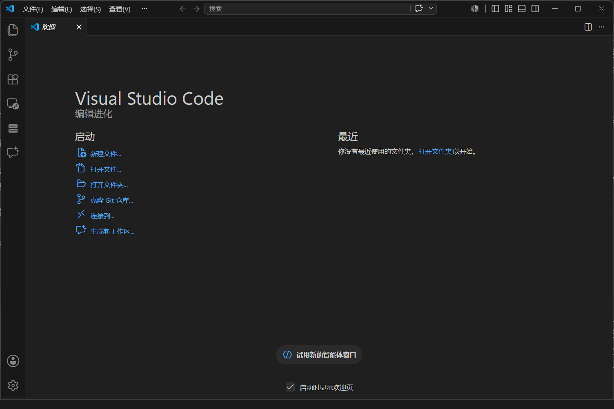

*图 01：VS Code 安装后的主界面。*

- 在等待安装的过程中可以去申请一个 [GitHub 账号](https://github.com/)。
- 如果可以成功打开，请重启电脑，以确保 PATH 不出问题。

## 第 2 步：安装 Git

1. 安装 Git：[Git for Windows 下载页](https://git-scm.com/install/windows)。
2. 快速懒人链接：[Git-2.55.0.3-64-bit.exe](https://github.com/git-for-windows/git/releases/download/v2.55.0.windows.3/Git-2.55.0.3-64-bit.exe)。
3. 下载好之后，只需要疯狂下一步就可以了。如果有什么问题后续可以让 Agent 帮忙调整，但只要先装 VS Code 再安装 Git 问题不大。
4. 安装好之后再一次重启电脑。

> **Agent 补充｜确认安装成功**
>
> 重启后打开 PowerShell，分别运行 `code --version` 和 `git --version`。两条命令都能显示版本号，说明 VS Code 与 Git 已经进入 PATH。Git 官方下载页在 **2026-07-20** 列出的 x64 安装包版本是 `2.55.0.3`，与上面的快速下载链接一致。

## 第 3 步：登录 VS Code 并安装 UCP

<strong class="step-number">1</strong> 打开 VS Code，点击左下角的人头图标，把你的 GitHub 账号登录到 VS Code 里，这样就能打开你的设置云同步。

<!-- image-id: FN-001-02 | path: images/fn-001/fn-001-02.png -->
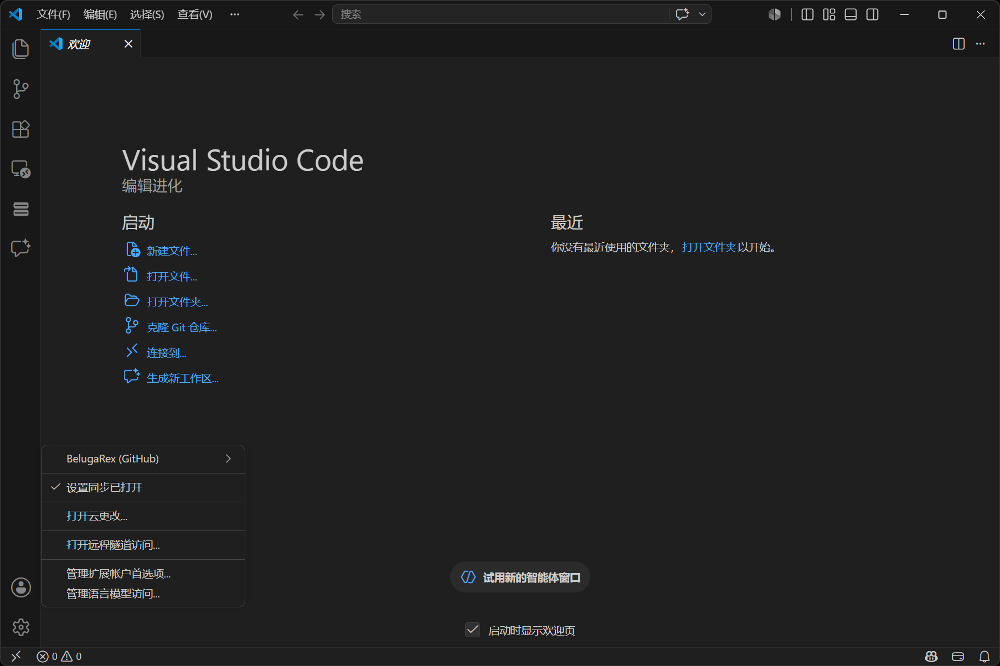

*图 02：VS Code 左下角的登录入口。*

<strong class="step-number">2</strong> 然后安装插件，在左侧，点击扩展。

<!-- image-id: FN-001-03 | path: images/fn-001/fn-001-03.png -->
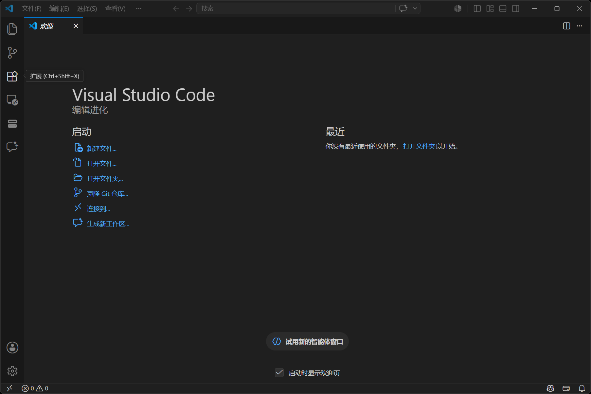

*图 03：VS Code 左侧的扩展入口。*

<strong class="step-number">3</strong> 请先安装此插件：**Unify Chat Provider**，安装好之后请重启 VS Code。

<!-- image-id: FN-001-04 | path: images/fn-001/fn-001-04.png -->
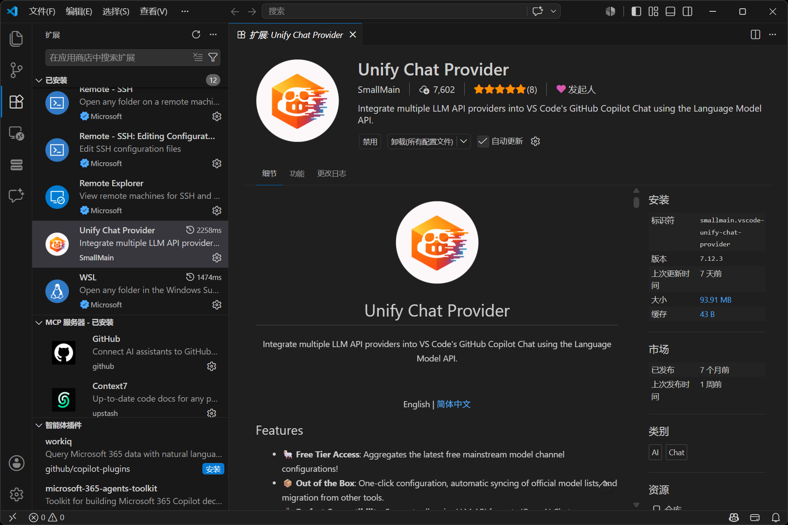

*图 04：Unify Chat Provider 扩展。*

> **Agent 补充｜核对扩展来源**
>
> VS Code Marketplace 中的扩展发布者是 **SmallMain**，扩展 ID 是 `SmallMain.vscode-unify-chat-provider`。截至 **2026-07-20**，公开版本为 `7.12.3`。可以在[扩展市场页面](https://marketplace.visualstudio.com/items?itemName=SmallMain.vscode-unify-chat-provider)和[项目仓库](https://github.com/smallmain/vscode-unify-chat-provider)交叉确认。

## 第 4 步：申请 DeepSeek API

1. 打开 [DeepSeek 开放平台](https://platform.deepseek.com/usage)。
2. 点击链接之后，申请/登录你的账号，然后在页面左侧边栏进行充值，创建并复制 API Key。

请注意，DeepSeek 的 API Key 只会在你创建的那一刻显示那一次，所以如果丢失了就需要重新创建一个新的，所以建议找办法保存。

充值只需要充值 10 元就差不多了，DeepSeek 还是很耐用的。

## 第 5 步：在 UCP 中配置 DeepSeek

<strong class="step-number">1</strong> 点击 VS Code 上方的输入框，输入 `unify chat provider`，选择内置供应商，这是 UCP 预先帮忙配置好的一些模型供应商。

<!-- image-id: FN-001-05 | path: images/fn-001/fn-001-05.png -->
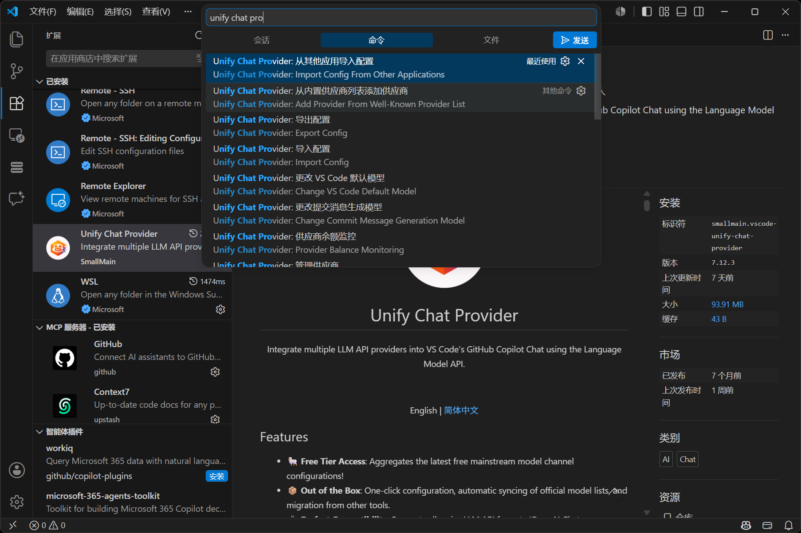

*图 05：UCP 的内置供应商入口。*

<strong class="step-number">2</strong> 然后输入 `DeepSeek` 就可以看到 DS 的供应商配置。

<!-- image-id: FN-001-06 | path: images/fn-001/fn-001-06.png -->
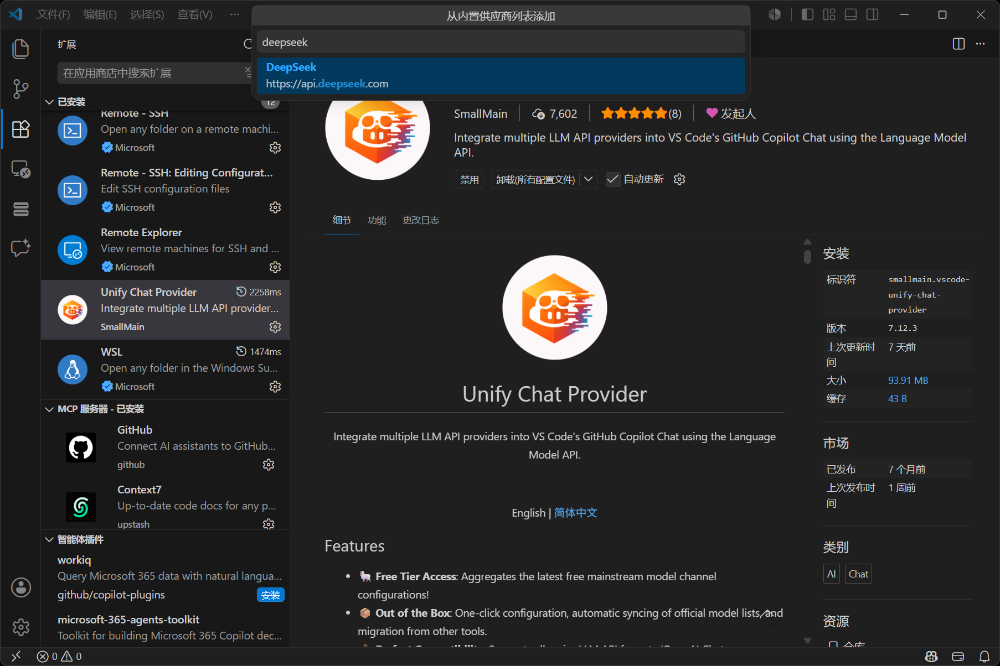

*图 06：UCP 中的 DeepSeek 供应商。*

<strong class="step-number">3</strong> 然后就是会要求你输入供应商名字，可以保持默认的 `DeepSeek`，按回车。
<strong class="step-number">4</strong> 然后粘贴你刚才复制的 API Key，然后再按回车。

<!-- image-id: FN-001-07 | path: images/fn-001/fn-001-07.png -->
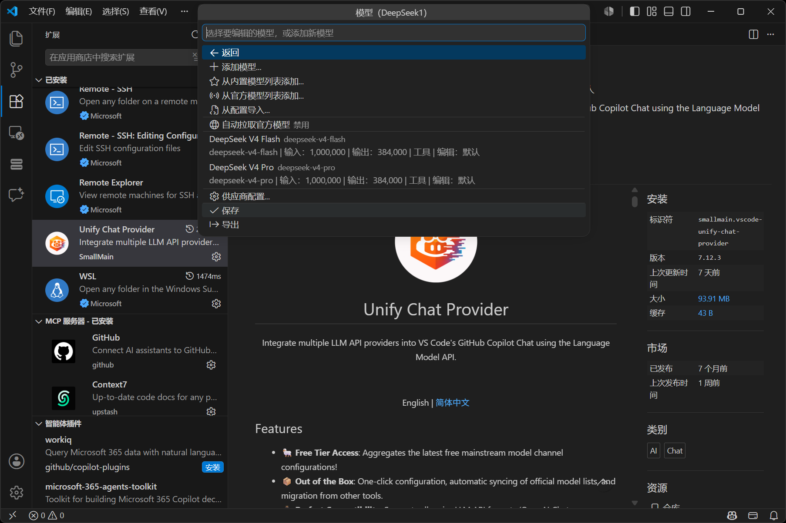

*图 07：DeepSeek 供应商配置界面。*

<strong class="step-number">5</strong> 然后就是以下这个界面，点击 **保存**。
<strong class="step-number">6</strong> 然后按 `Esc` 键。

<strong class="step-number">7</strong> 如果你配置正确，右下角应该会有一个银行卡的图标，把鼠标挪上去会显示余额情况。

<!-- image-id: FN-001-08 | path: images/fn-001/fn-001-08.png -->
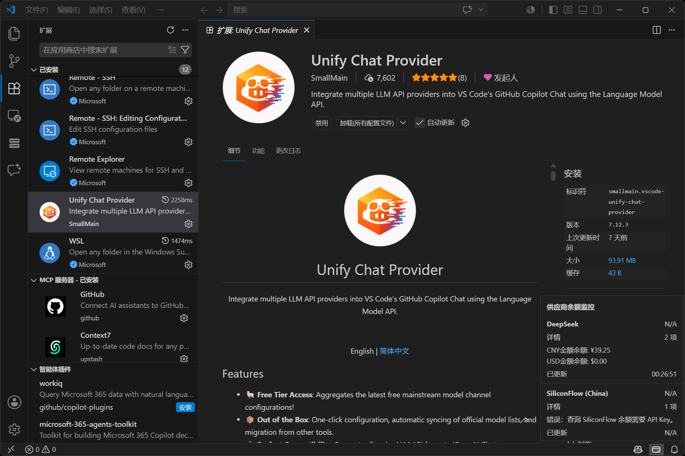

*图 08：UCP 显示的 DeepSeek 余额。*

## 第 6 步：把三个后台模型切到 DeepSeek

由于 VS Code 更新之后，需要多改三个后台模型，不然它们还是会走 GitHub Copilot 订阅，会额外花钱。

<strong class="step-number">1</strong> 在设置里，输入 `chat.utilityModel`，然后把 `chat.utilityModel` 和 `chat.utilitySmallModel` 两个模型改成 dsv4p。

<!-- image-id: FN-001-09 | path: images/fn-001/fn-001-09.png -->
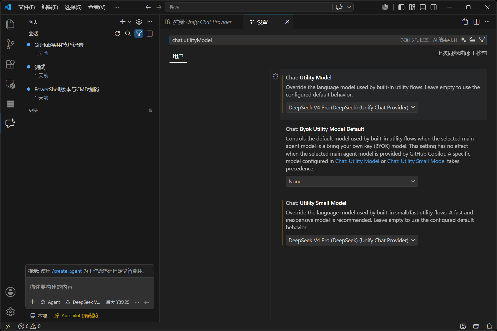

*图 09：修改 Utility Model 和 Utility Small Model。*

<strong class="step-number">2</strong> 如果你想省钱的话，也可以在设置里输入 `explore agent`，然后启用代码研究子代理，然后把模型改成 dsv4p（dsv4f 也可以，更便宜更快）。

<!-- image-id: FN-001-10 | path: images/fn-001/fn-001-10.png -->
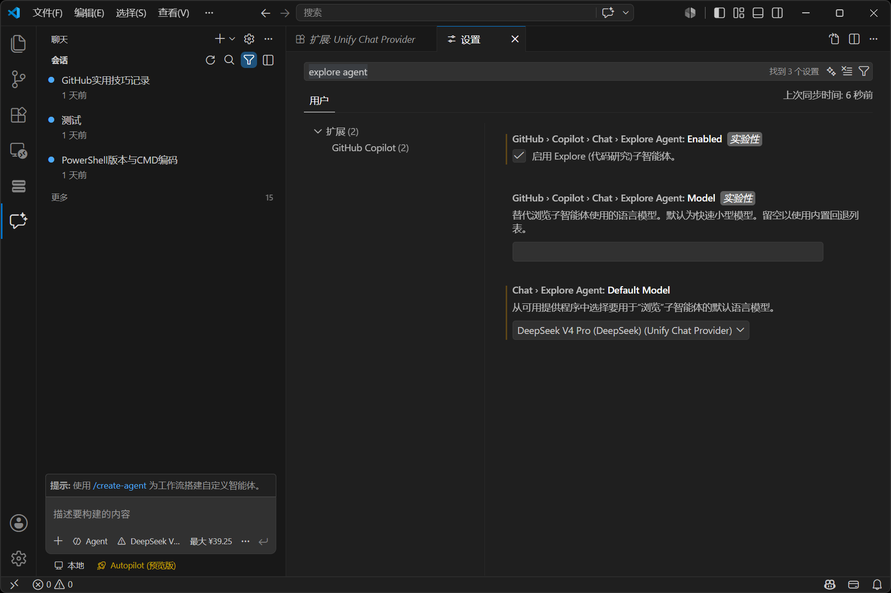

*图 10：修改 Explore Agent 模型。*

浏览子模型的更改可以让你在之后去买中转站模型的时候，使用那些比较贵的模型的时候，还是调用 DS 去进行代码的浏览，可以大幅省钱。

<strong class="step-number">3</strong> UCP 的开发者大佬针对这个问题提供了一个更快捷的处理方式。在主界面的顶部搜索框，搜索 `Unify Chat Provider: 更改 VS Code 默认模型`。

<!-- image-id: FN-001-19 | path: images/fn-001/fn-001-19.png -->
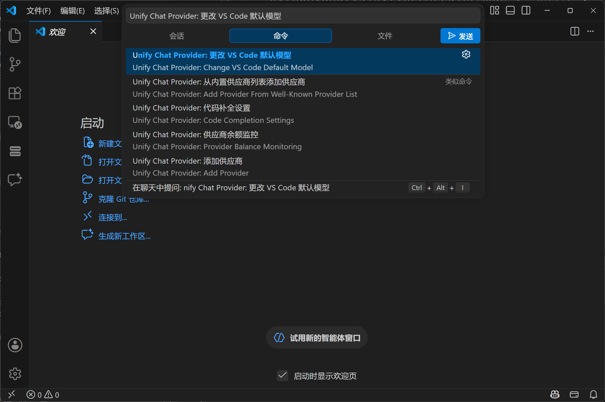

*图 19：搜索 UCP 更改默认模型命令。*

<strong class="step-number">4</strong> 然后选择这个命令，之后会有这个列表。

<!-- image-id: FN-001-20 | path: images/fn-001/fn-001-20.png -->
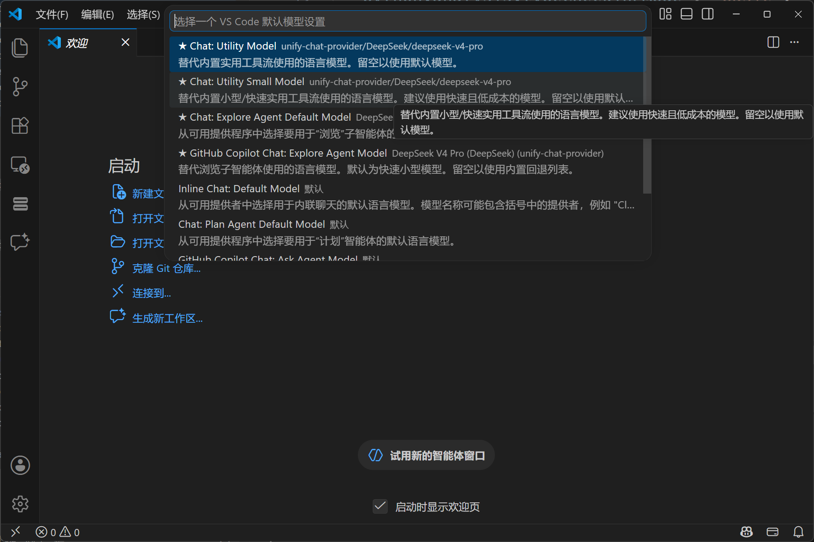

*图 20：UCP 提供的三个默认模型设置。*

<strong class="step-number">5</strong> 滚动到最下，点击 **更改所有内置实用模型**，然后选择 dsv4p，请仔细观察以下图片。

<!-- image-id: FN-001-21 | path: images/fn-001/fn-001-21.png -->
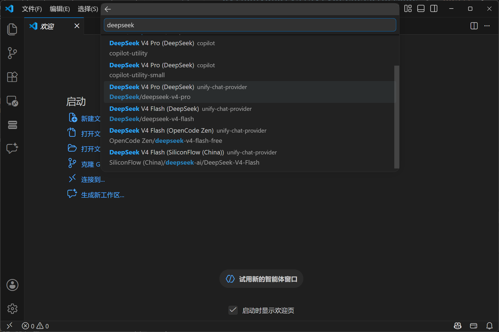

*图 21：选择 UCP 接入的 DeepSeek 官方供应商模型。*

你可能会和我一样有好多个 DeepSeek，因为可能是不同的供应商提供的，所以要仔细辨别。你要选的是借助 UCP 扩展接入的 DeepSeek 官方 API，获取更好的体验。

## 开始使用

<strong class="step-number">1</strong> 点击上面输入框旁边的 Chat 图标，就会显示。

<!-- image-id: FN-001-11 | path: images/fn-001/fn-001-11.png -->
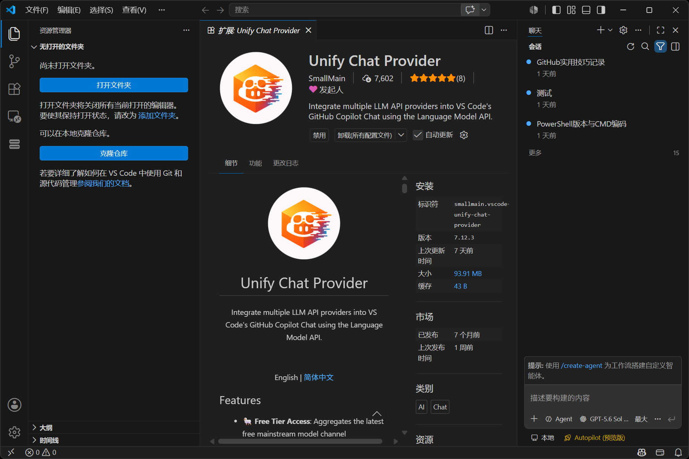

*图 11：打开 Chat 面板。*

<strong class="step-number">2</strong> 你可以拖拽“聊天”这两个字到左边的边栏，就可以显示到右边（我喜欢左边）。

<strong class="step-number">3</strong> 然后再聊天栏中，在底下，选择模型，可以选 DeepSeek V4 Flash 验证一下你是不是正常连接到了。

<!-- image-id: FN-001-12 | path: images/fn-001/fn-001-12.png -->
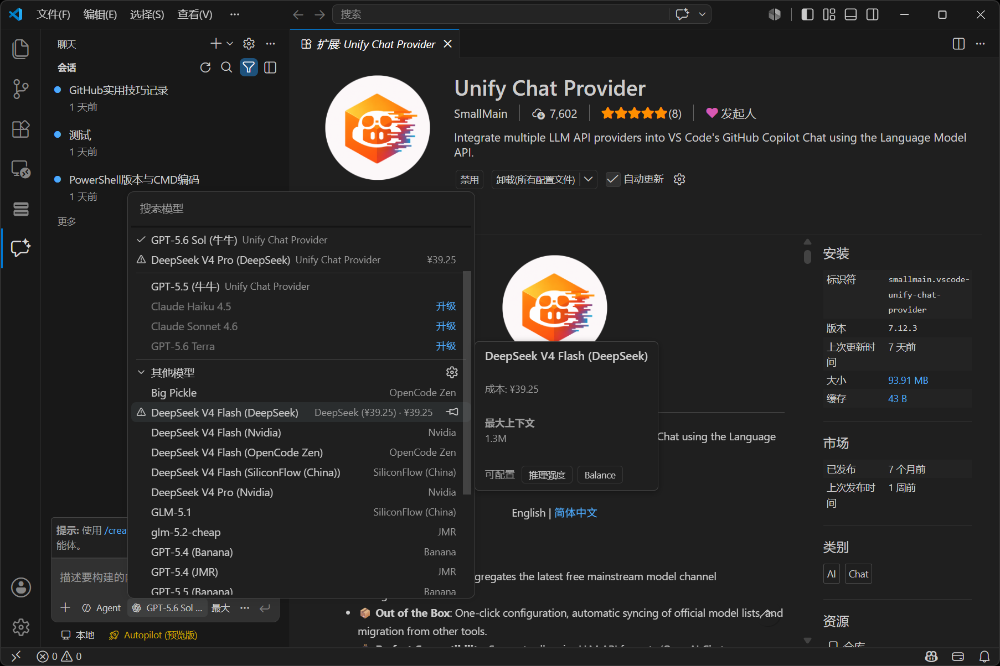

*图 12：切换到 DeepSeek V4 Flash。*

<strong class="step-number">4</strong> 输入点什么试试看，只要 DS 回你了基本上就没什么问题了。

<!-- image-id: FN-001-13 | path: images/fn-001/fn-001-13.png -->
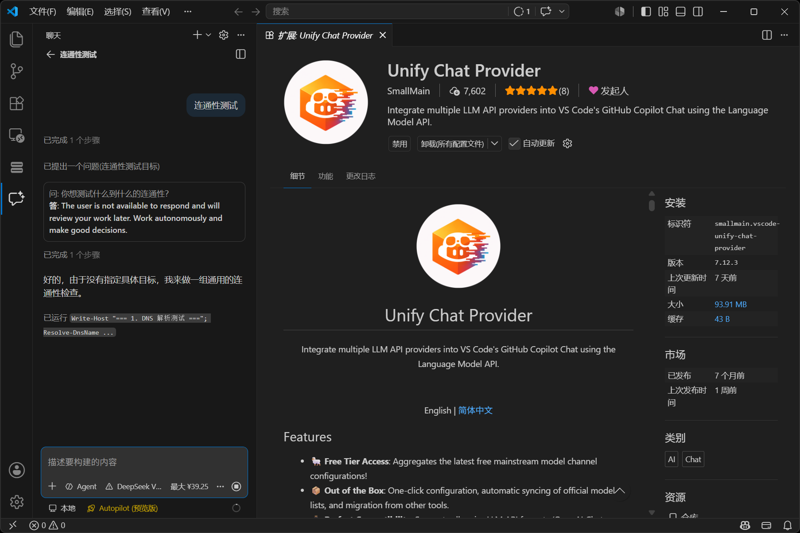

*图 13：实际测试结果。*

## 皮衣黄的福利：NVIDIA NIM

以上是内置的模型代理商的配置，我个人推荐的除了 DeepSeek，还推荐老黄的免费平台，就是比较慢。

皮衣黄的福利：[NVIDIA NIM](https://build.nvidia.com/models)。

和 DS 只有两个模型不同，老黄有好多，但不是都很好用，所以以下是暂时的推荐（2026-07-20）：

<strong class="step-number">1</strong> 前面的步骤都一样，在 UCP 的内置供应商里选择 NVIDIA，然后输入你的 API Key，按回车键。

<strong class="step-number">2</strong> 接着点击 **从官方模型列表添加**。

<!-- image-id: FN-001-14 | path: images/fn-001/fn-001-14.png -->
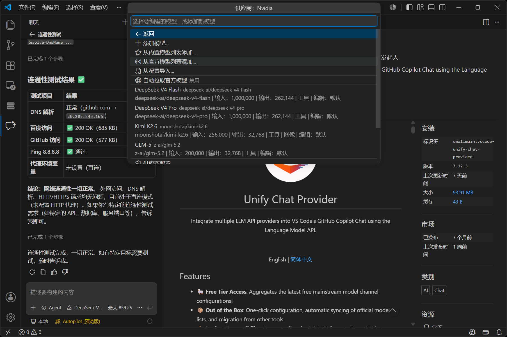

*图 14：从官方模型列表添加模型。*

<strong class="step-number">3</strong> 然后就会有这个列表让你选择了，勾选之后点击确认，只推荐上图那几个模型。

<!-- image-id: FN-001-15 | path: images/fn-001/fn-001-15.png -->
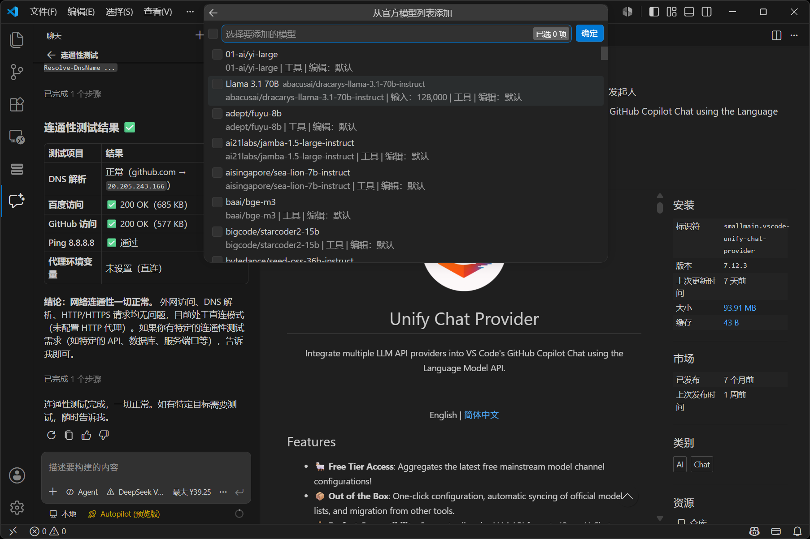

*图 15：NVIDIA NIM 模型列表。*

<strong class="step-number">4</strong> 老黄的 NIM 还需要改动供应商配置，点击 **供应商配置**。

<!-- image-id: FN-001-16 | path: images/fn-001/fn-001-16.png -->
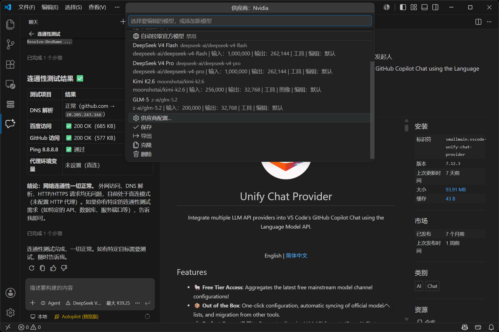

*图 16：打开 NVIDIA 供应商配置。*

<strong class="step-number">5</strong> 选择 **网络设置**。

<!-- image-id: FN-001-17 | path: images/fn-001/fn-001-17.png -->
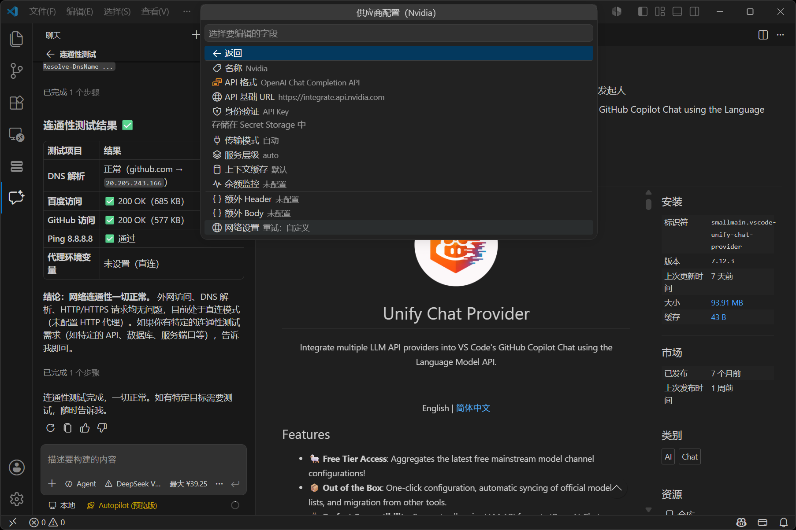

*图 17：打开网络设置。*

<strong class="step-number">6</strong> 按照下图的设置，修改 **连接超时**、**响应超时**、**最大重试次数**，然后点击 **返回** 到供应商配置，点击 **返回** 到供应商页面，然后点击 **保存**，然后就可以按 `Esc`，开始薅老黄羊毛。

<!-- image-id: FN-001-18 | path: images/fn-001/fn-001-18.png -->
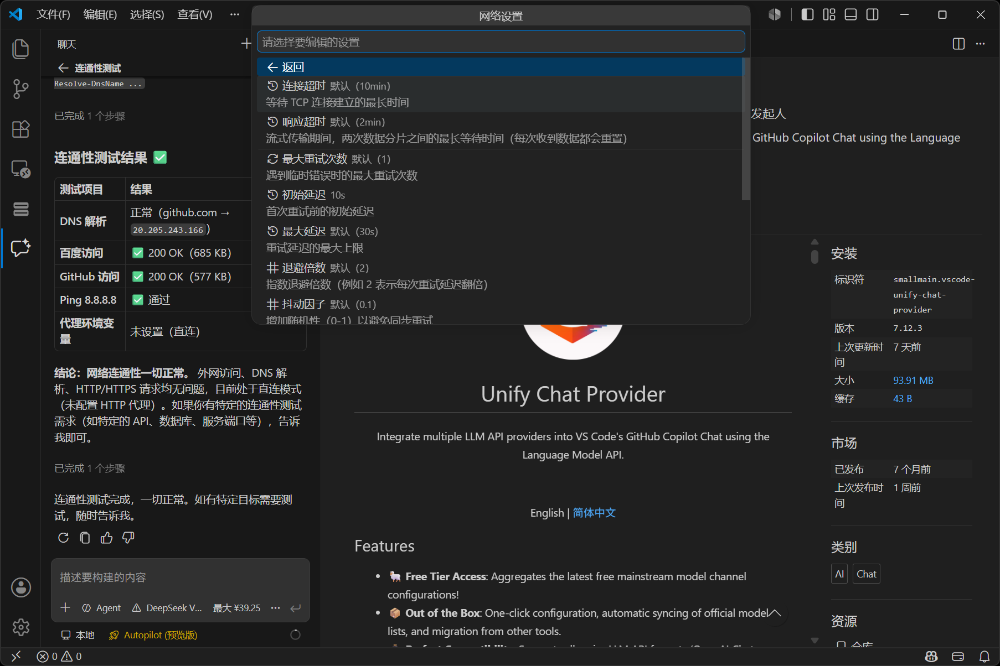

*图 18：调整连接超时、响应超时和最大重试次数。*

> **Agent 补充｜时效提醒**
>
> Git 安装包、UCP 版本、DeepSeek 模型和 NVIDIA NIM 模型列表都可能更新。本页外部入口最后核验于 **2026-07-20**；如果界面名称变化，可以优先按页面中的关键词搜索。