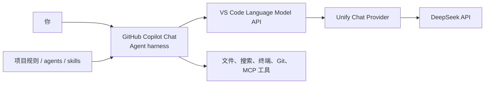

# Windows 上用 VS Code + UCP + DeepSeek：操作索引

> 想先跑起来，就按前三篇从上往下做；每篇只完成一个能看见结果的小任务。

最后核验：**2026-07-19**，使用 **Unify Chat Provider 7.12.4**。

## 直接照做

1. [在 Windows 准备 Git 和 VS Code](Windows-准备-Git-和-VS-Code)  
   完成后，PowerShell 能运行 `git` 和 `code`，VS Code 能打开 Copilot Chat。
2. [用 UCP 把 DeepSeek 接入 VS Code](UCP-接入-DeepSeek)  
   完成后，模型选择器里能看到 DeepSeek V4 Flash 或 V4 Pro。
3. [在 Copilot Chat 运行 DeepSeek Agent](Copilot-Chat-运行-DeepSeek-Agent)  
   完成后，Agent 能读取工作区、创建文件、运行命令并根据错误继续修复。

先把这三步走通就够了。车能开起来以后，再研究后备箱里还可以放什么。

## 跑通后按需查

- [用 UCP 设置 VS Code 默认模型](UCP-设置-VS-Code-默认模型)：让 Utility、Explore、Plan 等后台任务也使用预期模型。
- [给 VS Code Agent 添加项目规则](VS-Code-Agent-项目规则)：固定项目命令、目录职责、边界和完成标准。
- [给 VS Code Agent 接入 MCP](VS-Code-Agent-接入-MCP)：连接浏览器、数据库、工单等外部能力。
- [检查 VS Code Agent 的安全与成本](VS-Code-Agent-安全与成本)：开始任务前快速检查 Key、上下文、权限和模型费用。
- [处理 UCP 和 DeepSeek 常见问题](UCP-DeepSeek-常见问题)：按 401、无模型、无工具、429 等现象直接排查。

## 这套组合有什么用

它把模型、Agent harness、编辑器工具和项目规则拆成可替换的几层。模型可以按任务切换，文件修改和终端动作仍留在 VS Code 中查看，项目约定也能跟着 Git 一起维护。

| 层 | 负责什么 |
| --- | --- |
| DeepSeek | 理解任务、推理并决定下一步动作 |
| UCP | 保存供应商配置，把模型请求发送到 DeepSeek API |
| Copilot Chat | 组织 Agent 循环并调用工具 |
| VS Code | 展示修改、运行命令、连接 Git 和调试器 |
| 项目配置 | 保存 instructions、custom agents、skills 和 hooks |

UCP 在这里是模型提供者，不是另一套 Agent 框架。换模型不会拿走 Copilot Chat 原有的 Agent 模式和工具体系。