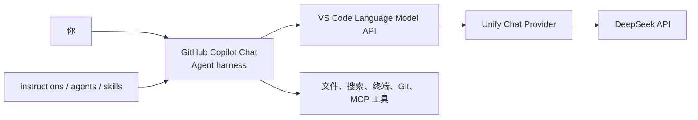

# Windows 上用 VS Code + UCP + DeepSeek 搭建可控的 Agent 工作流

> 用 GitHub Copilot Chat 做 Agent harness，用 Unify Chat Provider 接入 DeepSeek，把模型、工具、规则和审批权拆成自己能掌控的几层。

本文最后核验于 **2026-07-19**，使用 **Unify Chat Provider 7.12.4**。DeepSeek 的模型、价格和界面会变化，遇到差异时以文末官方资料为准。

## 先说结论

如果你本来就在 VS Code 中写代码，这套 Agent 工作流并不是 OpenCode、Codex CLI 或 Claude Code 的“将就替代品”。就我的使用感受，它在完成日常开发任务时并不逊色，反而更容易看清和控制 Agent 正在做什么：

- 上下文、文件、终端、Git diff 和问题面板都在同一个窗口。
- 每次文件修改都能直接审阅，终端命令可以逐次确认。
- 模型与 Agent harness 解耦，可以按价格、速度和任务切换供应商。
- instructions、custom agents、skills、MCP 和 hooks 都能放进项目并接受版本控制。
- 不需要离开熟悉的编辑、调试、测试和源代码管理流程。

这里的重点不是争论哪个工具“最强”，而是先搭出一条顺滑、透明、可替换的工作链路。

## 最终会得到什么

完成本文后，数据流大致如下：



各层职责不要混淆：

| 层 | 负责什么 |
| --- | --- |
| DeepSeek | 理解任务、推理并决定下一步动作 |
| UCP | 保存供应商配置，把 VS Code 的模型请求转换并发送到 DeepSeek API |
| Copilot Chat | 组织 Agent 循环、提供聊天界面、调用文件/终端/MCP 等工具 |
| VS Code | 展示和审批修改，运行命令，连接 Git、调试器与其他扩展 |
| 项目配置 | 用 instructions、custom agents、skills 和 hooks 约束工作方式 |

**UCP 是模型提供者，不是另一个 Agent 框架。** 正因为它只替换模型层，Copilot Chat 原有的 Agent 模式和工具体系仍然保留。

## 准备清单

- Windows 10 或 Windows 11。
- 一个 GitHub 账号；**Copilot Free 就够用**。
- 一个 DeepSeek 开放平台账号和少量 API 余额。
- 能访问 GitHub、VS Code Marketplace 与 DeepSeek API 的网络环境。
- 一个不包含敏感代码的练习目录。

DeepSeek API 按 Token 从充值余额或赠送余额扣费。第一次体验建议先小额充值，并在确认工作流适合自己之后再增加余额。

## 第一步：安装 Git for Windows

从 [Git for Windows 官方页面](https://git-scm.com/install/windows) 下载 x64 安装包。一般保持默认选项即可；不确定某个选项时，不必为了“优化”随意修改默认值。

安装完成后，关闭并重新打开 PowerShell，然后验证：

```powershell
git --version
```

能看到版本号就说明 Git 已进入 `PATH`。再设置提交身份：

```powershell
git config --global user.name "你的 GitHub 用户名"
git config --global user.email "你的 GitHub noreply 邮箱"
```

Git 在这套流程中不只是“上传代码”的工具。每次让 Agent 动手前先提交一次，之后就能清楚看到它改了什么，也能随时回退。

## 第二步：安装并初始化 VS Code

从 [VS Code 官方 Windows 安装说明](https://code.visualstudio.com/docs/setup/windows) 下载 **User Setup**。它不需要管理员权限，更新也最顺滑。

安装完成后重新打开 PowerShell，验证：

```powershell
code --version
```

打开 VS Code 后：

1. 点击状态栏中的 Copilot 图标。
2. 选择 **Use AI Features**。
3. 使用 GitHub 账号登录。
4. 没有付费订阅时，按提示开通 Copilot Free。
5. 按 `Ctrl+Shift+I` 打开 Chat。

Copilot Free 有自己的月度额度，但后面实际对话会选择 DeepSeek。登录的主要目的，是使用 Copilot Chat 这套 harness 和 Agent UI。

## 第三步：安装 Unify Chat Provider

按 `Ctrl+Shift+X` 打开扩展市场，搜索：

`@id:SmallMain.vscode-unify-chat-provider`

确认扩展名称是 **Unify Chat Provider**、发布者是 **SmallMain**，然后安装。也可以直接打开 [扩展市场页面](https://marketplace.visualstudio.com/items?itemName=SmallMain.vscode-unify-chat-provider)。

安装后建议执行一次 **Developer: Reload Window**。随后按 `Ctrl+Shift+P`，输入 `ucp:`；如果能看到一组 `Unify Chat Provider` 命令，说明扩展已正常激活。

UCP 7.12.4 要求 VS Code 1.104.0 或更新版本。直接使用最新稳定版 VS Code，通常不需要单独处理版本问题。

## 第四步：申请 DeepSeek API Key

1. 登录 [DeepSeek 开放平台](https://platform.deepseek.com/)。
2. 查看余额并按需充值。
3. 打开 [API Keys](https://platform.deepseek.com/api_keys)。
4. 创建一个专门给 VS Code 使用的 Key。
5. 复制 Key，完成 UCP 配置后删除剪贴板内容。

API Key 通常以 `sk-` 开头。它等同于可消费余额的密码：

- 不要发进聊天消息。
- 不要写进 README、截图、`.env` 示例或 Git 提交。
- 不要为了多设备同步而公开保存。
- 怀疑泄露时立即在 DeepSeek 控制台删除并重建。

截至本文验证日期，优先使用这两个模型：

| 模型 | 建议用途 |
| --- | --- |
| `deepseek-v4-flash` | 日常问答、搜索、轻量修改和高频 Agent 任务，速度快且便宜 |
| `deepseek-v4-pro` | 复杂规划、跨文件实现、困难排错和更重的推理任务 |

旧名称 `deepseek-chat` 与 `deepseek-reasoner` 将于 **2026-07-24 15:59 UTC** 弃用，不建议新配置继续使用。V4 Flash 和 V4 Pro 都支持工具调用，官方当前标注的上下文长度为 1M Token。

## 第五步：在 UCP 中一键接入 DeepSeek

1. 按 `Ctrl+Shift+P` 打开命令面板。
2. 运行 **Unify Chat Provider: 从内置供应商列表添加供应商**。
3. 搜索并选择 **DeepSeek**。
4. 选择 API Key 身份验证，并粘贴刚创建的 Key。
5. 在导入页面确认配置，然后保存。

内置配置会处理主要字段：

| 字段 | 应有值 |
| --- | --- |
| API 格式 | OpenAI Chat Completion |
| Base URL | `https://api.deepseek.com` |
| 身份验证 | API Key |
| 模型 | 自动拉取官方模型，并套用 UCP 内置推荐参数 |

UCP 默认把实际 Key 存进 VS Code Secret Storage，设置文件中只保留类似 `$UCPSECRET:...$` 的引用。不要开启 `unifyChatProvider.storeApiKeyInSettings`；开启后 Key 会以明文进入 `settings.json`，设置同步和日志排查都更容易造成泄露。

如果一键配置没有拉到模型：

1. 运行 **Unify Chat Provider: 管理供应商**。
2. 打开 DeepSeek 的模型列表。
3. 启用 **自动拉取官方模型**。
4. 点击刷新，或运行 **刷新所有供应商的官方模型**。

## 第六步：在 Copilot Chat 中选择 DeepSeek

1. 按 `Ctrl+Shift+I` 打开 Chat。
2. 将会话模式切换到 **Agent**。
3. 打开模型选择器。
4. 选择 **DeepSeek V4 Flash (DeepSeek)**，或需要更强推理时选择 V4 Pro。
5. 如果模型子菜单提供思考强度，日常任务先用 `High`，困难任务再用 `Max`。

DeepSeek V4 默认支持思考模式。`High` 更均衡，`Max` 会增加推理时间与输出成本；“永远拉满”通常不是最好的默认策略。

## 第七步：做一次真正的 Agent 验证

新建一个空目录，在 VS Code 终端中运行：

```powershell
git init
code .
```

确认 Chat 当前是 **Agent + DeepSeek V4 Flash**，然后发送：

> 请先检查当前工作区并给出简短计划。然后创建一个 `hello-agent.ps1`：接受 `-Name` 参数，输出带当前时间的问候语。运行 `./hello-agent.ps1 -Name Foggy` 验证；如果失败就修复。最后总结修改内容和验证结果。

第一次使用时，不要急着开启所有自动批准。观察这几个信号：

1. Agent 是否先读取工作区并列出计划。
2. 创建文件前是否展示工具动作。
3. 运行 PowerShell 命令时是否让你确认。
4. 失败后是否能读取终端输出并继续修复。
5. 完成后，源代码管理视图是否清楚显示 diff。

能完成“读取 → 规划 → 修改 → 运行 → 根据结果修复 → 总结”这个闭环，才说明接入的是可用 Agent 工作流，而不只是换了一个聊天模型。

## 让 VS Code 更有掌控感的关键

### 1. 用 Git 给 Agent 加安全绳

在开始较大任务前保持工作区干净并创建提交。Agent 完成后先看 diff，再决定保留、局部撤销还是整体回退。不要把“模型看起来很聪明”当作跳过代码审查的理由。

### 2. 把便宜模型分配给后台任务

运行 **Unify Chat Provider: 更改 VS Code 默认模型**，可以修改 utility、Explore、Ask、Plan、Implement 和 inline chat 等默认模型。

一个实用起点：

- Utility、Utility Small、Explore、Ask：`deepseek-v4-flash`。
- Plan、Implement：先用 `deepseek-v4-flash`，复杂任务手动切换 `deepseek-v4-pro`。
- 图片理解：另配支持视觉的模型；DeepSeek V4 当前是文本模型。

这也能避免 Copilot Free 的后台实用任务悄悄消耗它自己的免费额度。

### 3. 把长期规则写进仓库

在 Chat 中输入 `/init`，可以让 VS Code 为项目生成 `.github/copilot-instructions.md`。如果还会使用 Codex、Claude Code、OpenCode 等其他 Agent，可以改用根目录 `AGENTS.md` 维护跨工具规则。

适合写进去的内容包括：

- 项目技术栈和目录职责。
- 构建、测试、格式化命令。
- 禁止修改的文件和安全边界。
- 代码风格、错误处理和提交约定。
- 任务完成前必须执行的验证。

### 4. 用 custom agents 控制角色与工具

VS Code 的 `.github/agents/*.agent.md` 可以为不同角色指定模型、instructions 和工具白名单。例如：

- Planner：只允许搜索与读取，不允许写文件。
- Implementer：允许编辑、终端和测试。
- Reviewer：读取 diff，专注正确性、安全与回归风险。

还可以通过 handoff 把“规划 → 实现 → 审查”串成有人工检查点的流程。这种显式工具边界，就是图形化 harness 相比全自动黑盒更让我安心的地方。

### 5. MCP 只接入真正需要的能力

工作区 MCP 配置位于 `.vscode/mcp.json`，可为 Agent 增加浏览器、数据库、工单系统等外部工具。MCP 不是越多越好：每一个本地服务器都可能执行程序或访问数据。

在 Windows 上尤其要注意，VS Code 官方目前不提供本地 MCP sandbox。只安装可信发布者的服务器，逐项检查命令、参数、环境变量和可用工具，不要把 Key 硬编码进 `mcp.json`。

## 安全与成本检查表

- [ ] DeepSeek Key 只保存在 UCP 默认的 Secret Storage。
- [ ] 仓库、截图、聊天消息和终端历史中没有 Key。
- [ ] 清楚知道选中的代码与聊天上下文会发送给 DeepSeek API。
- [ ] 涉及公司或客户代码前，已确认组织的数据与模型使用政策。
- [ ] 开始任务前有 Git 提交，结束后审阅 diff。
- [ ] 初期逐次审批终端和 MCP 工具，不盲目全自动批准。
- [ ] 使用 V4 Pro、长上下文或 `Max` 推理前知道会增加费用。
- [ ] 定期检查余额，泄露时立即撤销 Key。

## 常见问题

### 模型选择器里没有 DeepSeek

- 执行 **Developer: Reload Window**。
- 用 **管理供应商** 确认 DeepSeek 配置已保存。
- 刷新官方模型列表。
- 更新 UCP，并运行 **同步内置参数到所有配置**。

### 返回 401

API Key 无效、被删除或复制时带入了多余字符。重新创建 Key 并在 UCP 中更新身份验证，不要把 Key 发到聊天里排错。

### 有模型但无法调用工具

确认选择的是 V4 Flash 或 V4 Pro，模型配置中的工具调用能力已启用，并同步最新的 UCP 内置参数。能普通聊天不代表模型配置一定适合 Agent。

### 请求很慢或出现 429

复杂思考和长上下文会增加首 Token 延迟。429 表示并发限制；等待 UCP 重试、减少并行会话或稍后再试。DeepSeek 在等待推理期间可能发送 keep-alive，过短的代理超时也会中断连接。

### 换电脑后配置在，但 Key 不见了

这是正常的安全设计：UCP 配置可以随 VS Code 设置同步，Secret Storage 中的 Key 默认不会同步。应在新设备上重新输入，而不是改成明文同步。

### 为什么 Copilot 免费额度仍在减少

VS Code 的 Utility、Explore 等后台任务可能仍使用 Copilot 内置模型。运行 UCP 的 **更改 VS Code 默认模型**，把这些任务切到 DeepSeek。

## 下一步

跑通本文的最小闭环后，再按实际痛点逐层增加能力：

1. 用 `/init` 固化项目规则。
2. 为规划、实现和审查拆分 custom agents。
3. 把重复流程封装成 prompt files 或 skills。
4. 只为明确需求添加 MCP，并限制工具范围。
5. 用 hooks 执行格式化、测试或阻止危险命令。
6. 在 UCP 中加入其他供应商，按任务切换模型，而不是绑定单一平台。

模型可以替换，工具可以增减，规则可以版本化，最终操作仍在熟悉的编辑器里可见、可审、可回退——这就是这套工作流最有价值的地方。

## 官方资料

- [VS Code：在 Windows 上安装](https://code.visualstudio.com/docs/setup/windows)
- [VS Code：设置 GitHub Copilot](https://code.visualstudio.com/docs/setup/copilot)
- [VS Code：自定义 Agent 行为](https://code.visualstudio.com/docs/agent-customization/overview)
- [VS Code：Custom instructions](https://code.visualstudio.com/docs/agent-customization/custom-instructions)
- [VS Code：Custom agents](https://code.visualstudio.com/docs/agent-customization/custom-agents)
- [VS Code：MCP servers](https://code.visualstudio.com/docs/agent-customization/mcp-servers)
- [Git for Windows](https://git-scm.com/install/windows)
- [Unify Chat Provider 扩展市场](https://marketplace.visualstudio.com/items?itemName=SmallMain.vscode-unify-chat-provider)
- [Unify Chat Provider 源码与中文说明](https://github.com/smallmain/vscode-unify-chat-provider)
- [DeepSeek API：首次调用与模型名称](https://api-docs.deepseek.com/)
- [DeepSeek API：模型与价格](https://api-docs.deepseek.com/quick_start/pricing)
- [DeepSeek API：Thinking Mode](https://api-docs.deepseek.com/guides/thinking_mode)
- [DeepSeek API：速率限制](https://api-docs.deepseek.com/quick_start/rate_limit)